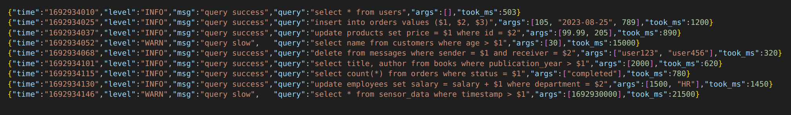

# QueryPulse

QueryPulse is a golang database driver that provides a callback so you can easily log
database queries, their arguments and how long they took.

When working with databases it can be tricky to understand when queries are slow. Sometimes
queries are fast for some inputs and not others. By logging slow queries you can easily find
examples of queries to optimise.



## Features

- Log all queries
- Configure your own logging function
  - Only log slow queries
  - Format how you like it
- Supports all database drivers
- Supports sqlx. See demo.

## Usage

```go
// Register the QueryPulse driver wrapping your other driver.
driverName, err := querypulse.Register(
    "postgres", // wrap the postgres driver
    querypulse.Options{
        // Provide an OnSuccess function to print all queries
        OnSuccess: func(query string, args []any, duration time.Duration) {
            fmt.Printf("OnSuccess: %v %v %v\n", query, args, duration)
        },
    })
...
// connect to the database using the driver like normal.
db, err := sql.Open(driverName, connStr)

// execute queries just an you normally would with the *sql.DB interface
rows, err := db.Query("select $1", 100)
```

Prints...

```sh
OnSuccess: select $1 [100] 135.176µs
```

### Usage with slog

```go
// Create a logger using slog.
jsonlog := slog.New(slog.NewJSONHandler(os.Stdout, nil))
slogDriver, err := qslog.Register("postgres", jsonlog)
..
slogDb, err := sql.Open(slogDriver, connStr)
if err != nil {
    panic(err)
}

rows, err = slogDb.Query("select $1", 300)
```

Logs...

```json
{
  "time": "2023-08-25T13:24:16.210197191+10:00",
  "level": "INFO",
  "msg": "query success",
  "query": "select $1",
  "args": [300],
  "took_ms": 77027
}
```

## Inspiration

This code was heavily inspired by [zipkin-go-sql](https://github.com/openzipkin-contrib/zipkin-go-sql). Thanks to the maintainers for the great example.
